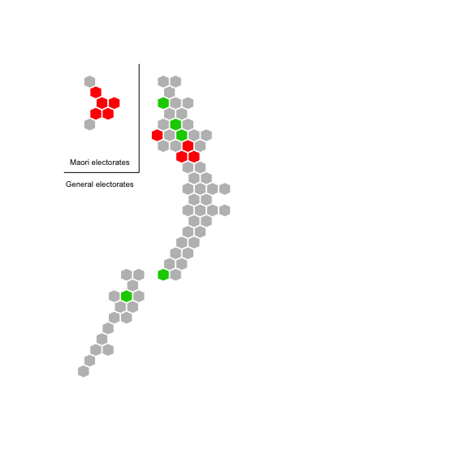

# election 2014
David Hood  
10 October 2014  

This is my own odds and ends of things about the New Zealand Election, it does not include the easy things, like the number of votes each party got in each electorate, but includes some things that need some more processing. I am assuming people are familiar with how New Zealands election is an MMP one.

# Sources

2014 Election Results are available at <http://www.electionresults.govt.nz>

2011 Election Results are available at <http://www.electionresults.govt.nz/electionresults_2011/>

But for this I have used the compiled election results at <https://github.com/jmarshallnz/nzpol/tree/swing/swing/data> for elect2011.csv, elect2014.csv, party2011.csv, party2014.csv

The number on the roll in 2014 in electoraldata14.txt comes from <http://www.elections.org.nz/research-statistics/enrolment-statistics-electorate> and <http://www.elections.org.nz/research-statistics/maori-enrolment-statistics-electorate>. The 2011 data in electoraldata11.txt comes from picking through entries in the Wayback Machine <http://archive.org/web/> since there were no obvious historical figures elsewhere.

The hexmap (http://rpubs.com/thoughtfulbloke/hexmap) positions are based on my interpretation of the layout developed by David Friggens <https://a3995c31ebd7ea534f2bb73d7af5d1ab1163a570.googledrive.com/host/0B-6BcF0gNMHCWjBYMm9jSmxlMTg/> which is an update of a layout of Chris McDonald <http://hindsight.clerestories.com/2014/01/06/chris-mcdowall-hexagonal-maps/>

__Note__: The Data files are in utf-8 to correctly represent Māori characters.


```r
electoraldata11 <- read.table("data/electoraldata11.txt", stringsAsFactors=FALSE, sep="\t", header=TRUE)
electoraldata14 <- read.table("data/electoraldata14.txt", stringsAsFactors=FALSE, sep="\t", header=TRUE)
elect2011 <- read.csv("data/elect2011.csv", stringsAsFactors=FALSE)
elect2014 <- read.csv("data/elect2014.csv", stringsAsFactors=FALSE)
party2011 <- read.csv("data/party2011.csv", stringsAsFactors=FALSE)
party2014 <- read.csv("data/party2014.csv", stringsAsFactors=FALSE)

e11 <- merge(elect2011, electoraldata11, by.x="X", by.y="Electorate")
e14 <- merge(elect2014, electoraldata14, by.x="X", by.y="Electorate")

p11 <- merge(party2011, electoraldata11, by.x="X", by.y="Electorate")
p14 <- merge(party2014, electoraldata14, by.x="X", by.y="Electorate")

tp11 <- p11[,1:16]
tp11[,2:16] <- p11[,2:16]/p11$Gen
tp14 <- p14[,1:18]
tp14[,2:18] <- p14[,2:18]/p14$Gen

tp11$X[tp11$X == "Ōhariu"] <- "Ōhāriu"atching names between
tp11to14 <- merge(tp11,tp14, by="X")
```

# Inter-election results

Making the comparison of party vote as percent of electorate in 2008 vs party vote as percent of electorate in 2011 (on the assumption the electorates with the same name are compariable, which ignores the effect of boundary changes).


## National Party compared to previous election:

The National comparison between elections looks like:


```r
largestside= max(c(tp11to14$National.Party.y, tp11to14$National.Party.x))
plot(c(0,largestside),c(0,largestside), xlab="Party Vote proportion 2011", ylab="Party Vote proportion 2014", type="n")
points(tp11to14$National.Party.x, tp11to14$National.Party.y, pch=19, col="#0000FF33")
lines(c(-1,1),c(-1,1), col="#44444444")
nlm <- lm(tp11to14$National.Party.y ~ 0 + tp11to14$National.Party.x) #goes through 0
abline(nlm, col="#0000FF")
```

 

The gray line is the "line of same as last time", and the top left points are electorates that did better than last time. The blue line is the typical National result, so the distance above or below the line is how much better or worse the electorate improved relative to the typical result.

### Electorates in both electorates (in order of most improved)

```r
display = data.frame(electorate= tp11to14$X, change=nlm$residuals)
display = display[order(-display$change),]
knitr::kable(display)
```


|   |electorate            |  change|
|:--|:---------------------|-------:|
|49 |Selwyn                |  0.0372|
|18 |Hutt South            |  0.0326|
|42 |Port Hills            |  0.0313|
|52 |Taranaki-King Country |  0.0269|
|62 |Waimakariri           |  0.0247|
|64 |Waitaki               |  0.0231|
|28 |Mt Albert             |  0.0228|
|53 |Taupō                 |  0.0208|
|63 |Wairarapa             |  0.0196|
|48 |Rotorua               |  0.0195|
|54 |Tauranga              |  0.0188|
|50 |Tāmaki                |  0.0181|
|7  |Coromandel            |  0.0149|
|61 |Waikato               |  0.0148|
|38 |Ōtaki                 |  0.0129|
|17 |Hunua                 |  0.0127|
|29 |Mt Roskill            |  0.0119|
|4  |Christchurch Central  |  0.0116|
|33 |New Plymouth          |  0.0100|
|55 |Te Atatū              |  0.0092|
|22 |Kaikōura              |  0.0076|
|26 |Manurewa              |  0.0069|
|58 |Te Tai Tonga          |  0.0067|
|24 |Māngere               |  0.0066|
|68 |Whangarei             |  0.0060|
|46 |Rodney                |  0.0048|
|67 |Whanganui             |  0.0034|
|6  |Clutha-Southland      |  0.0030|
|30 |Napier                |  0.0029|
|11 |East Coast Bays       |  0.0028|
|8  |Dunedin North         |  0.0026|
|69 |Wigram                |  0.0022|
|57 |Te Tai Tokerau        |  0.0017|
|19 |Ikaroa-Rāwhiti        |  0.0010|
|56 |Te Tai Hauāuru        |  0.0007|
|66 |West Coast-Tasman     |  0.0006|
|23 |Mana                  |  0.0006|
|15 |Hauraki-Waikato       |  0.0003|
|59 |Tukituki              |  0.0000|
|1  |Auckland Central      |  0.0000|
|47 |Rongotai              | -0.0007|
|51 |Tāmaki Makaurau       | -0.0008|
|60 |Waiariki              | -0.0009|
|9  |Dunedin South         | -0.0017|
|25 |Manukau East          | -0.0018|
|21 |Invercargill          | -0.0023|
|44 |Rangitīkei            | -0.0030|
|36 |Northland             | -0.0038|
|3  |Botany                | -0.0054|
|65 |Wellington Central    | -0.0059|
|2  |Bay of Plenty         | -0.0073|
|31 |Nelson                | -0.0074|
|37 |Ōhāriu                | -0.0074|
|14 |Hamilton West         | -0.0085|
|10 |East Coast            | -0.0087|
|20 |Ilam                  | -0.0117|
|32 |New Lynn              | -0.0133|
|34 |North Shore           | -0.0157|
|40 |Palmerston North      | -0.0162|
|41 |Papakura              | -0.0162|
|39 |Pakuranga             | -0.0189|
|35 |Northcote             | -0.0201|
|45 |Rimutaka              | -0.0227|
|13 |Hamilton East         | -0.0245|
|12 |Epsom                 | -0.0266|
|27 |Maungakiekie          | -0.0273|
|5  |Christchurch East     | -0.0379|
|16 |Helensville           | -0.0445|
|43 |Rangitata             | -0.0601|

Electorates with a change between -0.0523 and 0.0533 (3 standard deviations) are highly unusual so Rangitata should be of particular interest to see what happened there.


```r
rounded <- round(display$change, digits=3)
stripchart(rounded,method = "stack", frame.plot=FALSE, pch=19, col="#0000FF", at=0.05,offset=0.5)
```

 

## Labour Party compared to previous election:

The Labour comparison between elections looks like:


```r
largestside= max(c(tp11to14$Labour.Party.y, tp11to14$Labour.Party.x))
plot(c(0,largestside),c(0,largestside), xlab="Party Vote proportion 2011", ylab="Party Vote proportion 2014", type="n")
points(tp11to14$Labour.Party.x, tp11to14$Labour.Party.y, pch=19, col="#FF000033")
lines(c(-1,1),c(-1,1), col="#44444444")
llm <- lm(tp11to14$Labour.Party.y ~ 0 + tp11to14$Labour.Party.x) #goes through 0
abline(llm, col="#FF0000")
```

 

The gray line is the "line of same as last time", and the top left points are electorates that did better than last time. The red line is the typical Labour result, so the distance above or below the line is how much better or worse the electorate improved relative to the typical result.

### Electorates in both electorates (in order of most improved)

```r
display = data.frame(electorate= tp11to14$X, change=llm$residuals)
display = display[order(-display$change),]
knitr::kable(display)
```


|   |electorate            |  change|
|:--|:---------------------|-------:|
|60 |Waiariki              |  0.0605|
|15 |Hauraki-Waikato       |  0.0517|
|19 |Ikaroa-Rāwhiti        |  0.0498|
|56 |Te Tai Hauāuru        |  0.0492|
|57 |Te Tai Tokerau        |  0.0450|
|51 |Tāmaki Makaurau       |  0.0339|
|58 |Te Tai Tonga          |  0.0330|
|5  |Christchurch East     |  0.0304|
|45 |Rimutaka              |  0.0225|
|69 |Wigram                |  0.0137|
|48 |Rotorua               |  0.0133|
|9  |Dunedin South         |  0.0103|
|8  |Dunedin North         |  0.0100|
|59 |Tukituki              |  0.0075|
|54 |Tauranga              |  0.0068|
|10 |East Coast            |  0.0064|
|67 |Whanganui             |  0.0058|
|36 |Northland             |  0.0056|
|53 |Taupō                 |  0.0049|
|32 |New Lynn              |  0.0046|
|41 |Papakura              |  0.0045|
|55 |Te Atatū              |  0.0034|
|46 |Rodney                |  0.0026|
|13 |Hamilton East         |  0.0022|
|2  |Bay of Plenty         |  0.0022|
|27 |Maungakiekie          |  0.0016|
|24 |Māngere               |  0.0013|
|4  |Christchurch Central  |  0.0011|
|61 |Waikato               |  0.0008|
|3  |Botany                |  0.0004|
|63 |Wairarapa             | -0.0013|
|20 |Ilam                  | -0.0015|
|6  |Clutha-Southland      | -0.0015|
|16 |Helensville           | -0.0021|
|31 |Nelson                | -0.0027|
|68 |Whangarei             | -0.0029|
|25 |Manukau East          | -0.0033|
|65 |Wellington Central    | -0.0041|
|26 |Manurewa              | -0.0053|
|23 |Mana                  | -0.0057|
|47 |Rongotai              | -0.0058|
|52 |Taranaki-King Country | -0.0058|
|66 |West Coast-Tasman     | -0.0071|
|7  |Coromandel            | -0.0072|
|40 |Palmerston North      | -0.0073|
|44 |Rangitīkei            | -0.0080|
|30 |Napier                | -0.0083|
|34 |North Shore           | -0.0083|
|49 |Selwyn                | -0.0086|
|39 |Pakuranga             | -0.0087|
|50 |Tāmaki                | -0.0088|
|21 |Invercargill          | -0.0095|
|42 |Port Hills            | -0.0098|
|22 |Kaikōura              | -0.0098|
|35 |Northcote             | -0.0102|
|64 |Waitaki               | -0.0103|
|12 |Epsom                 | -0.0109|
|14 |Hamilton West         | -0.0128|
|17 |Hunua                 | -0.0133|
|62 |Waimakariri           | -0.0133|
|37 |Ōhāriu                | -0.0141|
|38 |Ōtaki                 | -0.0228|
|1  |Auckland Central      | -0.0228|
|33 |New Plymouth          | -0.0242|
|11 |East Coast Bays       | -0.0281|
|28 |Mt Albert             | -0.0338|
|29 |Mt Roskill            | -0.0398|
|18 |Hutt South            | -0.0408|
|43 |Rangitata             | -0.0539|

Electorates with a change between -0.0627 and 0.0625 (3 standard deviations) are highly unusual so no electorates were that unusual.


```r
rounded <- round(display$change, digits=3)
stripchart(rounded,method = "stack", frame.plot=FALSE, pch=19, col="#FF0000", at=0.05,offset=0.5)
```

 

## Green Party compared to previous election:

The Greens comparison between elections looks like:


```r
largestside= max(c(tp11to14$Green.Party.y, tp11to14$Green.Party.x))
plot(c(0,largestside),c(0,largestside), xlab="Party Vote proportion 2011", ylab="Party Vote proportion 2014", type="n")
points(tp11to14$Green.Party.x, tp11to14$Green.Party.y, pch=19, col="#00FF0033")
lines(c(-1,1),c(-1,1), col="#44444444")
glm <- lm(tp11to14$Green.Party.y ~ 0 + tp11to14$Green.Party.x) #goes through 0
abline(glm, col="#00FF00")
```

 

The gray line is the "line of same as last time", and the top left points are electorates that did better than last time. The green line is the typical Green result, so the distance above or below the line is how much better or worse the electorate improved relative to the typical result.

### Electorates in both electorates (in order of most improved)

```r
display = data.frame(electorate= tp11to14$X, change=glm$residuals)
display = display[order(-display$change),]
knitr::kable(display)
```


|   |electorate            |  change|
|:--|:---------------------|-------:|
|16 |Helensville           |  0.0440|
|28 |Mt Albert             |  0.0406|
|47 |Rongotai              |  0.0222|
|65 |Wellington Central    |  0.0197|
|51 |Tāmaki Makaurau       |  0.0176|
|29 |Mt Roskill            |  0.0172|
|57 |Te Tai Tokerau        |  0.0158|
|58 |Te Tai Tonga          |  0.0158|
|19 |Ikaroa-Rāwhiti        |  0.0144|
|56 |Te Tai Hauāuru        |  0.0131|
|5  |Christchurch East     |  0.0112|
|15 |Hauraki-Waikato       |  0.0101|
|55 |Te Atatū              |  0.0089|
|62 |Waimakariri           |  0.0070|
|18 |Hutt South            |  0.0069|
|35 |Northcote             |  0.0044|
|46 |Rodney                |  0.0030|
|69 |Wigram                |  0.0029|
|37 |Ōhāriu                |  0.0029|
|50 |Tāmaki                |  0.0022|
|4  |Christchurch Central  |  0.0021|
|49 |Selwyn                |  0.0018|
|11 |East Coast Bays       |  0.0018|
|39 |Pakuranga             |  0.0015|
|12 |Epsom                 |  0.0015|
|8  |Dunedin North         |  0.0012|
|25 |Manukau East          |  0.0010|
|24 |Māngere               |  0.0005|
|60 |Waiariki              |  0.0005|
|3  |Botany                |  0.0004|
|23 |Mana                  |  0.0002|
|26 |Manurewa              |  0.0000|
|38 |Ōtaki                 | -0.0014|
|41 |Papakura              | -0.0021|
|27 |Maungakiekie          | -0.0023|
|34 |North Shore           | -0.0023|
|68 |Whangarei             | -0.0037|
|20 |Ilam                  | -0.0040|
|64 |Waitaki               | -0.0040|
|52 |Taranaki-King Country | -0.0049|
|36 |Northland             | -0.0051|
|66 |West Coast-Tasman     | -0.0055|
|14 |Hamilton West         | -0.0055|
|21 |Invercargill          | -0.0056|
|40 |Palmerston North      | -0.0061|
|6  |Clutha-Southland      | -0.0065|
|59 |Tukituki              | -0.0069|
|61 |Waikato               | -0.0076|
|30 |Napier                | -0.0079|
|17 |Hunua                 | -0.0081|
|63 |Wairarapa             | -0.0085|
|53 |Taupō                 | -0.0086|
|13 |Hamilton East         | -0.0087|
|9  |Dunedin South         | -0.0092|
|10 |East Coast            | -0.0097|
|45 |Rimutaka              | -0.0099|
|54 |Tauranga              | -0.0113|
|48 |Rotorua               | -0.0114|
|7  |Coromandel            | -0.0116|
|67 |Whanganui             | -0.0116|
|2  |Bay of Plenty         | -0.0120|
|44 |Rangitīkei            | -0.0124|
|31 |Nelson                | -0.0136|
|33 |New Plymouth          | -0.0138|
|1  |Auckland Central      | -0.0144|
|43 |Rangitata             | -0.0147|
|22 |Kaikōura              | -0.0148|
|42 |Port Hills            | -0.0167|
|32 |New Lynn              | -0.0189|

Electorates with a change between -0.0366 and 0.0358 (3 standard deviations) are highly unusual so Helensville and Mt Albert should be of particular interest to see what happened there.


```r
rounded <- round(display$change, digits=3)
stripchart(rounded,method = "stack", frame.plot=FALSE, pch=19, col="#00FF00", at=0.05,offset=0.5)
```

 


## New Zealand First Party compared to previous election:

The New Zealand First comparison between elections looks like:


```r
largestside= max(c(tp11to14$New.Zealand.First.Party.y, tp11to14$New.Zealand.First.Party.x))
plot(c(0,largestside),c(0,largestside), xlab="Party Vote proportion 2011", ylab="Party Vote proportion 2014", type="n")
points(tp11to14$New.Zealand.First.Party.x, tp11to14$New.Zealand.First.Party.y, pch=19, col="#00000033")
lines(c(-1,1),c(-1,1), col="#44444444")
nzflm <- lm(tp11to14$New.Zealand.First.Party.y ~ 0 + tp11to14$New.Zealand.First.Party.x) #goes through 0
abline(nzflm, col="#000000")
```

 

The gray line is the "line of same as last time", and the top left points are electorates that did better than last time. The black line is the typical New Zealand First result, so the distance above or below the line is how much better or worse the electorate improved relative to the typical result.

### Electorates in both elections (in order of most improved)

```r
display = data.frame(electorate= tp11to14$X, change=nzflm$residuals)
display = display[order(-display$change),]
knitr::kable(display)
```


|   |electorate            |  change|
|:--|:---------------------|-------:|
|57 |Te Tai Tokerau        |  0.0195|
|45 |Rimutaka              |  0.0177|
|21 |Invercargill          |  0.0171|
|58 |Te Tai Tonga          |  0.0167|
|56 |Te Tai Hauāuru        |  0.0160|
|63 |Wairarapa             |  0.0147|
|44 |Rangitīkei            |  0.0146|
|16 |Helensville           |  0.0128|
|19 |Ikaroa-Rāwhiti        |  0.0116|
|5  |Christchurch East     |  0.0115|
|66 |West Coast-Tasman     |  0.0114|
|15 |Hauraki-Waikato       |  0.0111|
|22 |Kaikōura              |  0.0100|
|49 |Selwyn                |  0.0093|
|51 |Tāmaki Makaurau       |  0.0090|
|62 |Waimakariri           |  0.0087|
|40 |Palmerston North      |  0.0087|
|68 |Whangarei             |  0.0083|
|69 |Wigram                |  0.0077|
|4  |Christchurch Central  |  0.0072|
|10 |East Coast            |  0.0054|
|33 |New Plymouth          |  0.0048|
|31 |Nelson                |  0.0048|
|61 |Waikato               |  0.0039|
|14 |Hamilton West         |  0.0037|
|23 |Mana                  |  0.0033|
|42 |Port Hills            |  0.0032|
|52 |Taranaki-King Country |  0.0029|
|64 |Waitaki               |  0.0023|
|46 |Rodney                |  0.0018|
|30 |Napier                |  0.0008|
|59 |Tukituki              |  0.0004|
|12 |Epsom                 | -0.0004|
|17 |Hunua                 | -0.0006|
|20 |Ilam                  | -0.0010|
|55 |Te Atatū              | -0.0010|
|13 |Hamilton East         | -0.0010|
|6  |Clutha-Southland      | -0.0013|
|65 |Wellington Central    | -0.0014|
|35 |Northcote             | -0.0016|
|9  |Dunedin South         | -0.0017|
|3  |Botany                | -0.0017|
|26 |Manurewa              | -0.0022|
|39 |Pakuranga             | -0.0023|
|67 |Whanganui             | -0.0023|
|60 |Waiariki              | -0.0025|
|53 |Taupō                 | -0.0025|
|36 |Northland             | -0.0028|
|47 |Rongotai              | -0.0028|
|27 |Maungakiekie          | -0.0032|
|24 |Māngere               | -0.0033|
|41 |Papakura              | -0.0033|
|18 |Hutt South            | -0.0033|
|50 |Tāmaki                | -0.0034|
|11 |East Coast Bays       | -0.0039|
|1  |Auckland Central      | -0.0042|
|37 |Ōhāriu                | -0.0042|
|8  |Dunedin North         | -0.0047|
|34 |North Shore           | -0.0053|
|25 |Manukau East          | -0.0057|
|38 |Ōtaki                 | -0.0068|
|29 |Mt Roskill            | -0.0070|
|43 |Rangitata             | -0.0083|
|48 |Rotorua               | -0.0090|
|32 |New Lynn              | -0.0095|
|28 |Mt Albert             | -0.0140|
|7  |Coromandel            | -0.0156|
|2  |Bay of Plenty         | -0.0228|
|54 |Tauranga              | -0.0374|

Electorates with a change between -0.0276 and 0.0298 (3 standard deviations) are highly unusual so the fall in Tauranga would seem to be the most interesting result. I would also note Winston Peter's direct appeal to New Zealand First supporters in Te Tai Tokerau seems to have had an effect on turnout there.


```r
rounded <- round(display$change, digits=3)
stripchart(rounded,method = "stack", frame.plot=FALSE, pch=19, col="#000000", at=0.05,offset=0.5)
```

 

As a general comment, the shift in popularity between elections seems to be more a measure of general party support, as all the trend lines were fairly strong between electorates for each party.


## Turnout Change correlations

Looking at the residuals of the changes in turnout, we can examine correlations between the parties, basically asking a question "are the changes in turnout for one party reflected in the changes for another party", which could suggest a postive or negative relationship. 1 is a perfect positive correlation, -1 is a perfect negative correlation, 0 is no correlation.

* National and Labour -0.0655
* National and Greens -0.0549
* National and New Zealand First -0.0773
* Labour and Greens 0.1639
* Labour and New Zealand First 0.3548
* Greens and New Zealand First 0.1905

This suggests that the strongest relationship, given the two elections, is that in electorates where Labour turned out well New Zealand First also turned out well. In electorates where Labour voters stayed home so did New Zealand First voters.

Looking through the scatterplots for all the larger parties, the trend lines are fairly consistant, suggestion changes in nationwide support for the party is more important than the actions of local candidates.

# 2014 results

Focusing on the 2014 elections only, and using all 71 electorates for that election.

## 2014 vote splitting

If a candidate belonging to a party gets a different number of votes than the party vote, some people must not have voted for both. The total of the difference for each electorate divided by two is the minimum number of people that must have split their vote (the maximum number is 100% except in cases where both the candidate and the party recieved more than 50% of the vote, when the maxmimum becomes twice the total of all other parties). When can use this minimum figure as a metric for "how MMP" each electorate voted.


```r
all14 <- merge(p14, e14, by="X")
nato0 <- all14[,c(2:21,23:35)]
nato0[is.na(nato0)] <- 0
all14[,c(2:21,23:35)] <- nato0

all14$splits <- (abs(all14$National.Party - all14$National) + abs(all14$Labour.Party - all14$Labour) + abs(all14$Green.Party - all14$Green) + abs(all14$New.Zealand.First.Party - all14$NZ.First) + abs(all14$Conservative.x - all14$Conservative.y) + abs(all14$Internet.MANA - all14$MANA) + abs(all14$Māori.Party - all14$Māori) + abs(all14$ACT.New.Zealand - all14$ACT) +  abs(all14$United.Future.x - all14$United.Future.y)) / (2* all14$TOTAL.y)
display = all14[,c("X","splits")]
names(display) <- c("Electorate", "MMPness")
display = display[order(-display$MMPness),]
knitr::kable(display)
```

```
## 
## 
## |   |Electorate            | MMPness|
## |:--|:---------------------|-------:|
## |38 |Ōhāriu                |  0.4759|
## |12 |Epsom                 |  0.4360|
## |62 |Waiariki              |  0.3758|
## |58 |Te Tai Tokerau        |  0.3249|
## |31 |Napier                |  0.3153|
## |15 |Hauraki-Waikato       |  0.3048|
## |29 |Mt Albert             |  0.2959|
## |67 |Wellington Central    |  0.2932|
## |59 |Te Tai Tonga          |  0.2585|
## |68 |West Coast-Tasman     |  0.2578|
## |52 |Tāmaki Makaurau       |  0.2507|
## |1  |Auckland Central      |  0.2313|
## |43 |Port Hills            |  0.2270|
## |64 |Waimakariri           |  0.2261|
## |69 |Whanganui             |  0.2221|
## |57 |Te Tai Hauāuru        |  0.2141|
## |24 |Mana                  |  0.2088|
## |30 |Mt Roskill            |  0.2085|
## |71 |Wigram                |  0.2078|
## |19 |Ikaroa-Rāwhiti        |  0.2041|
## |46 |Rimutaka              |  0.1978|
## |48 |Rongotai              |  0.1953|
## |41 |Palmerston North      |  0.1939|
## |5  |Christchurch East     |  0.1759|
## |8  |Dunedin North         |  0.1697|
## |9  |Dunedin South         |  0.1662|
## |32 |Nelson                |  0.1649|
## |65 |Wairarapa             |  0.1619|
## |49 |Rotorua               |  0.1598|
## |39 |Ōtaki                 |  0.1589|
## |18 |Hutt South            |  0.1582|
## |44 |Rangitata             |  0.1521|
## |45 |Rangitīkei            |  0.1504|
## |33 |New Lynn              |  0.1502|
## |40 |Pakuranga             |  0.1475|
## |56 |Te Atatū              |  0.1467|
## |37 |Northland             |  0.1467|
## |14 |Hamilton West         |  0.1436|
## |34 |New Plymouth          |  0.1331|
## |4  |Christchurch Central  |  0.1315|
## |36 |Northcote             |  0.1284|
## |60 |Tukituki              |  0.1204|
## |28 |Maungakiekie          |  0.1185|
## |53 |Taranaki-King Country |  0.1156|
## |7  |Coromandel            |  0.1105|
## |11 |East Coast Bays       |  0.1105|
## |3  |Botany                |  0.1070|
## |13 |Hamilton East         |  0.1013|
## |10 |East Coast            |  0.0985|
## |23 |Kelston               |  0.0967|
## |2  |Bay of Plenty         |  0.0966|
## |63 |Waikato               |  0.0925|
## |16 |Helensville           |  0.0919|
## |66 |Waitaki               |  0.0843|
## |70 |Whangarei             |  0.0824|
## |17 |Hunua                 |  0.0805|
## |6  |Clutha-Southland      |  0.0756|
## |54 |Taupō                 |  0.0745|
## |25 |Māngere               |  0.0737|
## |35 |North Shore           |  0.0728|
## |20 |Ilam                  |  0.0717|
## |22 |Kaikōura              |  0.0711|
## |42 |Papakura              |  0.0677|
## |21 |Invercargill          |  0.0667|
## |51 |Tāmaki                |  0.0647|
## |61 |Upper Harbour         |  0.0644|
## |50 |Selwyn                |  0.0625|
## |26 |Manukau East          |  0.0499|
## |55 |Tauranga              |  0.0378|
## |27 |Manurewa              |  0.0319|
## |47 |Rodney                |  0.0316|
```

The four electorates that saw the most vote splitting (led by Ōhāriu with 47.6% vote splitting) we all electorates where the election of a electorate candidate could make a big difference to the overall shape of parliament.

## Two Party comparisons

By subtracting the votes for one party by the votes for another party we can get the overall national difference of support for both parties, then ask the question how much do individual electorates vary in support. As electorates are not of indentical size, I have divided the difference by the number of potential voters so the difference are normalised for electorate. I have also calculated the z-score to determine 3 categories of electorates. Supportive of each party and in between. In reality life is not a binary choice.


```r
areas <- read.csv("data/hex2.csv", stringsAsFactors=FALSE)
library(plotrix)
hexmap <- function(xcor,ycor,colval){
  plot(min(c(xcor,ycor)):(max(c(xcor,ycor))+1),min(c(xcor,ycor)):(max(c(xcor,ycor))+1), type="n", frame.plot=F, xaxt="n", yaxt="n", xlab="", ylab="")
  data <- data.frame(xcor,ycor,colval)
  apply(data, 1, function(zone) hexagon(zone[1],zone[2],col=zone[3], unitcell=0.95,border="white"))
  polygon(c(-2,-2,6,6),c(40,20,20,40))
  text(2.8,21,"Maori electorates", cex=0.6)
  text(2.8,19,"General electorates", cex=0.6)
}

all14w.area <- merge(all14,areas, by="X")
```

Party A area > 1 z-score, typical area, -1 z-score > party B area

### National and Labour


```r
team1 <- all14w.area$National.Party
team2 <- all14w.area$Labour.Party
diff <- (team1 - team2)/all14w.area$TOTAL.x
zscore <- (diff - mean(diff))/sd(diff)
mycols <- rep(4, length(zscore))
mycols[zscore <= 1] <- 8
mycols[zscore < -1] <- 2
hexmap(all14w.area$xcord, all14w.area$ycord, mycols)
```

 

```r
adf <- data.frame(electorate = all14w.area$X, zscore)
```


```r
knitr::kable(adf[order(-adf$zscore),])
```


|   |electorate            |  zscore|
|:--|:---------------------|-------:|
|11 |East Coast Bays       |  1.2169|
|51 |Tāmaki                |  1.2041|
|17 |Hunua                 |  1.1992|
|50 |Selwyn                |  1.1941|
|12 |Epsom                 |  1.1768|
|47 |Rodney                |  1.1265|
|6  |Clutha-Southland      |  1.1186|
|53 |Taranaki-King Country |  1.0979|
|35 |North Shore           |  1.0765|
|16 |Helensville           |  1.0193|
|63 |Waikato               |  0.9958|
|2  |Bay of Plenty         |  0.9662|
|40 |Pakuranga             |  0.9601|
|55 |Tauranga              |  0.8426|
|20 |Ilam                  |  0.7958|
|22 |Kaikōura              |  0.7749|
|66 |Waitaki               |  0.7578|
|64 |Waimakariri           |  0.7377|
|54 |Taupō                 |  0.7354|
|7  |Coromandel            |  0.7343|
|3  |Botany                |  0.6927|
|45 |Rangitīkei            |  0.6097|
|34 |New Plymouth          |  0.5916|
|44 |Rangitata             |  0.5377|
|70 |Whangarei             |  0.5056|
|37 |Northland             |  0.5026|
|65 |Wairarapa             |  0.4863|
|61 |Upper Harbour         |  0.4531|
|49 |Rotorua               |  0.4487|
|60 |Tukituki              |  0.3836|
|36 |Northcote             |  0.3631|
|38 |Ōhāriu                |  0.2988|
|13 |Hamilton East         |  0.2736|
|10 |East Coast            |  0.2597|
|42 |Papakura              |  0.2387|
|21 |Invercargill          |  0.2042|
|39 |Ōtaki                 |  0.1948|
|31 |Napier                |  0.1674|
|1  |Auckland Central      |  0.1620|
|43 |Port Hills            |  0.1562|
|14 |Hamilton West         |  0.1151|
|69 |Whanganui             |  0.1051|
|68 |West Coast-Tasman     |  0.0847|
|32 |Nelson                |  0.0287|
|4  |Christchurch Central  | -0.0207|
|18 |Hutt South            | -0.0631|
|71 |Wigram                | -0.1781|
|67 |Wellington Central    | -0.1940|
|41 |Palmerston North      | -0.2524|
|29 |Mt Albert             | -0.3518|
|46 |Rimutaka              | -0.3910|
|5  |Christchurch East     | -0.4267|
|9  |Dunedin South         | -0.4651|
|30 |Mt Roskill            | -0.4710|
|28 |Maungakiekie          | -0.4755|
|24 |Mana                  | -0.4826|
|56 |Te Atatū              | -0.4857|
|33 |New Lynn              | -0.5956|
|48 |Rongotai              | -0.6304|
|8  |Dunedin North         | -0.6968|
|23 |Kelston               | -1.0816|
|59 |Te Tai Tonga          | -1.5569|
|27 |Manurewa              | -1.6637|
|58 |Te Tai Tokerau        | -1.7181|
|52 |Tāmaki Makaurau       | -1.9555|
|62 |Waiariki              | -1.9738|
|57 |Te Tai Hauāuru        | -2.0245|
|15 |Hauraki-Waikato       | -2.1625|
|19 |Ikaroa-Rāwhiti        | -2.3000|
|26 |Manukau East          | -2.3223|
|25 |Māngere               | -2.6551|

### National and Green


```r
team1 <- all14w.area$National.Party
team2 <- all14w.area$Green.Party
diff <- (team1 - team2)/all14w.area$TOTAL.x
zscore <- (diff - mean(diff))/sd(diff)
mycols <- rep(4, length(zscore))
mycols[zscore <= 1] <- 8
mycols[zscore < -1] <- 3
hexmap(all14w.area$xcord, all14w.area$ycord, mycols)
```

 

```r
adf <- data.frame(electorate = all14w.area$X, zscore)
```


```r
knitr::kable(adf[order(-adf$zscore),])
```


|   |electorate            |  zscore|
|:--|:---------------------|-------:|
|17 |Hunua                 |  1.3426|
|51 |Tāmaki                |  1.2756|
|6  |Clutha-Southland      |  1.2020|
|3  |Botany                |  1.1799|
|11 |East Coast Bays       |  1.1768|
|63 |Waikato               |  1.1311|
|53 |Taranaki-King Country |  1.1228|
|40 |Pakuranga             |  1.1124|
|50 |Selwyn                |  1.0372|
|47 |Rodney                |  1.0334|
|12 |Epsom                 |  0.9443|
|35 |North Shore           |  0.9416|
|54 |Taupō                 |  0.9364|
|2  |Bay of Plenty         |  0.9073|
|55 |Tauranga              |  0.8033|
|64 |Waimakariri           |  0.8032|
|44 |Rangitata             |  0.7668|
|34 |New Plymouth          |  0.7569|
|22 |Kaikōura              |  0.7358|
|61 |Upper Harbour         |  0.7344|
|66 |Waitaki               |  0.6579|
|42 |Papakura              |  0.6515|
|45 |Rangitīkei            |  0.6427|
|49 |Rotorua               |  0.6125|
|16 |Helensville           |  0.5950|
|20 |Ilam                  |  0.5855|
|7  |Coromandel            |  0.5595|
|65 |Wairarapa             |  0.5455|
|60 |Tukituki              |  0.5056|
|21 |Invercargill          |  0.4176|
|31 |Napier                |  0.3446|
|70 |Whangarei             |  0.3363|
|69 |Whanganui             |  0.3154|
|14 |Hamilton West         |  0.2810|
|39 |Ōtaki                 |  0.2798|
|10 |East Coast            |  0.2759|
|36 |Northcote             |  0.2600|
|13 |Hamilton East         |  0.2517|
|37 |Northland             |  0.2029|
|38 |Ōhāriu                |  0.0456|
|41 |Palmerston North      | -0.0667|
|46 |Rimutaka              | -0.0923|
|56 |Te Atatū              | -0.0927|
|18 |Hutt South            | -0.1158|
|30 |Mt Roskill            | -0.1235|
|28 |Maungakiekie          | -0.1413|
|68 |West Coast-Tasman     | -0.1594|
|32 |Nelson                | -0.2413|
|71 |Wigram                | -0.2542|
|43 |Port Hills            | -0.2638|
|33 |New Lynn              | -0.3073|
|4  |Christchurch Central  | -0.3232|
|24 |Mana                  | -0.3882|
|9  |Dunedin South         | -0.3968|
|5  |Christchurch East     | -0.4222|
|27 |Manurewa              | -0.6200|
|1  |Auckland Central      | -0.6693|
|23 |Kelston               | -0.7394|
|29 |Mt Albert             | -0.9819|
|26 |Manukau East          | -1.0320|
|25 |Māngere               | -1.3029|
|8  |Dunedin North         | -1.4333|
|67 |Wellington Central    | -1.5055|
|48 |Rongotai              | -1.6060|
|58 |Te Tai Tokerau        | -2.0480|
|59 |Te Tai Tonga          | -2.0811|
|15 |Hauraki-Waikato       | -2.0878|
|62 |Waiariki              | -2.1340|
|52 |Tāmaki Makaurau       | -2.2003|
|57 |Te Tai Hauāuru        | -2.2360|
|19 |Ikaroa-Rāwhiti        | -2.2441|

### National and New Zealand First


```r
team1 <- all14w.area$National.Party
team2 <- all14w.area$New.Zealand.First.Party
diff <- (team1 - team2)/all14w.area$TOTAL.x
zscore <- (diff - mean(diff))/sd(diff)
mycols <- rep(4, length(zscore))
mycols[zscore <= 1] <- 8
mycols[zscore < -1] <- 1
hexmap(all14w.area$xcord, all14w.area$ycord, mycols)
```

 

```r
adf <- data.frame(electorate = all14w.area$X, zscore)
```


```r
knitr::kable(adf[order(-adf$zscore),])
```


|   |electorate            |  zscore|
|:--|:---------------------|-------:|
|51 |Tāmaki                |  1.4594|
|12 |Epsom                 |  1.3907|
|11 |East Coast Bays       |  1.2339|
|6  |Clutha-Southland      |  1.2145|
|50 |Selwyn                |  1.1888|
|35 |North Shore           |  1.1442|
|17 |Hunua                 |  1.0502|
|3  |Botany                |  1.0414|
|40 |Pakuranga             |  0.9909|
|20 |Ilam                  |  0.9531|
|47 |Rodney                |  0.9213|
|53 |Taranaki-King Country |  0.9141|
|16 |Helensville           |  0.8672|
|66 |Waitaki               |  0.8084|
|63 |Waikato               |  0.7630|
|64 |Waimakariri           |  0.7418|
|44 |Rangitata             |  0.6598|
|61 |Upper Harbour         |  0.6512|
|54 |Taupō                 |  0.6128|
|34 |New Plymouth          |  0.6105|
|22 |Kaikōura              |  0.6104|
|38 |Ōhāriu                |  0.5423|
|60 |Tukituki              |  0.4698|
|2  |Bay of Plenty         |  0.4337|
|36 |Northcote             |  0.4121|
|13 |Hamilton East         |  0.3797|
|45 |Rangitīkei            |  0.3514|
|31 |Napier                |  0.3267|
|7  |Coromandel            |  0.3124|
|55 |Tauranga              |  0.2886|
|65 |Wairarapa             |  0.2582|
|42 |Papakura              |  0.2374|
|43 |Port Hills            |  0.2354|
|49 |Rotorua               |  0.2053|
|1  |Auckland Central      |  0.1996|
|39 |Ōtaki                 |  0.1532|
|21 |Invercargill          |  0.1143|
|18 |Hutt South            |  0.0834|
|4  |Christchurch Central  |  0.0674|
|14 |Hamilton West         |  0.0314|
|70 |Whangarei             |  0.0303|
|32 |Nelson                |  0.0255|
|10 |East Coast            |  0.0250|
|30 |Mt Roskill            |  0.0217|
|37 |Northland             | -0.0099|
|68 |West Coast-Tasman     | -0.0189|
|69 |Whanganui             | -0.0581|
|29 |Mt Albert             | -0.0822|
|28 |Maungakiekie          | -0.0836|
|41 |Palmerston North      | -0.1021|
|71 |Wigram                | -0.1173|
|67 |Wellington Central    | -0.1309|
|24 |Mana                  | -0.1530|
|56 |Te Atatū              | -0.2171|
|33 |New Lynn              | -0.2524|
|46 |Rimutaka              | -0.3017|
|9  |Dunedin South         | -0.3260|
|5  |Christchurch East     | -0.3501|
|48 |Rongotai              | -0.5304|
|8  |Dunedin North         | -0.6293|
|23 |Kelston               | -0.7292|
|27 |Manurewa              | -1.0605|
|26 |Manukau East          | -1.4001|
|25 |Māngere               | -1.6357|
|59 |Te Tai Tonga          | -2.0272|
|57 |Te Tai Hauāuru        | -2.3876|
|15 |Hauraki-Waikato       | -2.4519|
|19 |Ikaroa-Rāwhiti        | -2.4612|
|58 |Te Tai Tokerau        | -2.4642|
|52 |Tāmaki Makaurau       | -2.4931|
|62 |Waiariki              | -2.5585|

### Labour and Green


```r
team1 <- all14w.area$Labour.Party
team2 <- all14w.area$Green.Party
diff <- (team1 - team2)/all14w.area$TOTAL.x
zscore <- (diff - mean(diff))/sd(diff)
mycols <- rep(2, length(zscore))
mycols[zscore <= 1] <- 8
mycols[zscore < -1] <- 3
hexmap(all14w.area$xcord, all14w.area$ycord, mycols)
```

 

```r
adf <- data.frame(electorate = all14w.area$X, zscore)
```


```r
knitr::kable(adf[order(-adf$zscore),])
```


|   |electorate            |  zscore|
|:--|:---------------------|-------:|
|25 |Māngere               |  3.7556|
|26 |Manukau East          |  3.4341|
|27 |Manurewa              |  2.6255|
|19 |Ikaroa-Rāwhiti        |  1.7076|
|15 |Hauraki-Waikato       |  1.6361|
|23 |Kelston               |  1.2407|
|62 |Waiariki              |  1.1767|
|57 |Te Tai Hauāuru        |  1.1417|
|52 |Tāmaki Makaurau       |  1.0466|
|56 |Te Atatū              |  0.8888|
|33 |New Lynn              |  0.8215|
|30 |Mt Roskill            |  0.8155|
|28 |Maungakiekie          |  0.8002|
|58 |Te Tai Tokerau        |  0.7605|
|46 |Rimutaka              |  0.6911|
|24 |Mana                  |  0.4730|
|41 |Palmerston North      |  0.4364|
|9  |Dunedin South         |  0.4244|
|42 |Papakura              |  0.4029|
|59 |Te Tai Tonga          |  0.3769|
|5  |Christchurch East     |  0.3086|
|69 |Whanganui             |  0.2169|
|3  |Botany                |  0.1842|
|21 |Invercargill          |  0.1510|
|14 |Hamilton West         |  0.1482|
|31 |Napier                |  0.1269|
|61 |Upper Harbour         |  0.0687|
|71 |Wigram                |  0.0206|
|39 |Ōtaki                 | -0.0203|
|18 |Hutt South            | -0.0284|
|44 |Rangitata             | -0.0636|
|49 |Rotorua               | -0.0911|
|60 |Tukituki              | -0.1028|
|10 |East Coast            | -0.1616|
|34 |New Plymouth          | -0.1901|
|13 |Hamilton East         | -0.2243|
|54 |Taupō                 | -0.2426|
|65 |Wairarapa             | -0.2626|
|45 |Rangitīkei            | -0.3864|
|32 |Nelson                | -0.3946|
|68 |West Coast-Tasman     | -0.3982|
|36 |Northcote             | -0.4003|
|4  |Christchurch Central  | -0.4046|
|64 |Waimakariri           | -0.4321|
|40 |Pakuranga             | -0.4693|
|63 |Waikato               | -0.5183|
|8  |Dunedin North         | -0.5269|
|38 |Ōhāriu                | -0.5627|
|70 |Whangarei             | -0.5930|
|22 |Kaikōura              | -0.6034|
|29 |Mt Albert             | -0.6238|
|17 |Hunua                 | -0.6511|
|55 |Tauranga              | -0.6515|
|66 |Waitaki               | -0.6754|
|6  |Clutha-Southland      | -0.6772|
|43 |Port Hills            | -0.6928|
|53 |Taranaki-King Country | -0.7435|
|51 |Tāmaki                | -0.7542|
|7  |Coromandel            | -0.7627|
|2  |Bay of Plenty         | -0.7664|
|37 |Northland             | -0.7717|
|20 |Ilam                  | -0.8555|
|48 |Rongotai              | -0.9053|
|11 |East Coast Bays       | -0.9180|
|47 |Rodney                | -0.9273|
|35 |North Shore           | -0.9498|
|50 |Selwyn                | -1.0638|
|12 |Epsom                 | -1.1564|
|1  |Auckland Central      | -1.2670|
|16 |Helensville           | -1.3104|
|67 |Wellington Central    | -1.6801|

### Labour and New Zealand First


```r
team1 <- all14w.area$Labour.Party
team2 <- all14w.area$New.Zealand.First.Party
diff <- (team1 - team2)/all14w.area$TOTAL.x
zscore <- (diff - mean(diff))/sd(diff)
mycols <- rep(2, length(zscore))
mycols[zscore <= 1] <- 8
mycols[zscore < -1] <- 1
hexmap(all14w.area$xcord, all14w.area$ycord, mycols)
```

 

```r
adf <- data.frame(electorate = all14w.area$X, zscore)
```


```r
knitr::kable(adf[order(-adf$zscore),])
```


|   |electorate            |  zscore|
|:--|:---------------------|-------:|
|25 |Māngere               |  3.6575|
|26 |Manukau East          |  3.2442|
|27 |Manurewa              |  2.2394|
|19 |Ikaroa-Rāwhiti        |  1.6263|
|23 |Kelston               |  1.3970|
|15 |Hauraki-Waikato       |  1.3256|
|30 |Mt Roskill            |  1.1095|
|57 |Te Tai Hauāuru        |  1.1048|
|33 |New Lynn              |  0.9895|
|28 |Maungakiekie          |  0.9641|
|24 |Mana                  |  0.8780|
|52 |Tāmaki Makaurau       |  0.7912|
|56 |Te Atatū              |  0.7902|
|62 |Waiariki              |  0.7364|
|29 |Mt Albert             |  0.6833|
|8  |Dunedin North         |  0.6645|
|48 |Rongotai              |  0.6587|
|9  |Dunedin South         |  0.5826|
|59 |Te Tai Tonga          |  0.5676|
|5  |Christchurch East     |  0.4589|
|46 |Rimutaka              |  0.4488|
|41 |Palmerston North      |  0.4267|
|58 |Te Tai Tokerau        |  0.2910|
|18 |Hutt South            |  0.2674|
|67 |Wellington Central    |  0.2504|
|71 |Wigram                |  0.2341|
|4  |Christchurch Central  |  0.1468|
|38 |Ōhāriu                |  0.1173|
|31 |Napier                |  0.0995|
|43 |Port Hills            | -0.0097|
|32 |Nelson                | -0.0280|
|3  |Botany                | -0.0466|
|13 |Hamilton East         | -0.0651|
|61 |Upper Harbour         | -0.0748|
|1  |Auckland Central      | -0.0759|
|60 |Tukituki              | -0.1836|
|42 |Papakura              | -0.1955|
|14 |Hamilton West         | -0.2170|
|39 |Ōtaki                 | -0.2195|
|68 |West Coast-Tasman     | -0.2216|
|36 |Northcote             | -0.2221|
|44 |Rangitata             | -0.2555|
|21 |Invercargill          | -0.2983|
|69 |Whanganui             | -0.3262|
|20 |Ilam                  | -0.4128|
|34 |New Plymouth          | -0.4515|
|66 |Waitaki               | -0.5395|
|10 |East Coast            | -0.5572|
|64 |Waimakariri           | -0.5920|
|51 |Tāmaki                | -0.5989|
|12 |Epsom                 | -0.6382|
|49 |Rotorua               | -0.7232|
|65 |Wairarapa             | -0.7310|
|40 |Pakuranga             | -0.7327|
|6  |Clutha-Southland      | -0.7652|
|35 |North Shore           | -0.7725|
|54 |Taupō                 | -0.7771|
|22 |Kaikōura              | -0.8711|
|45 |Rangitīkei            | -0.8756|
|11 |East Coast Bays       | -0.9614|
|50 |Selwyn                | -0.9758|
|16 |Helensville           | -1.0508|
|70 |Whangarei             | -1.1118|
|63 |Waikato               | -1.1511|
|53 |Taranaki-King Country | -1.1612|
|37 |Northland             | -1.1642|
|17 |Hunua                 | -1.1921|
|47 |Rodney                | -1.2162|
|7  |Coromandel            | -1.2182|
|55 |Tauranga              | -1.5009|
|2  |Bay of Plenty         | -1.5696|

### Green and New Zealand First


```r
team1 <- all14w.area$Green.Party
team2 <- all14w.area$New.Zealand.First.Party
diff <- (team1 - team2)/all14w.area$TOTAL.x
zscore <- (diff - mean(diff))/sd(diff)
mycols <- rep(3, length(zscore))
mycols[zscore <= 1] <- 8
mycols[zscore < -1] <- 1
hexmap(all14w.area$xcord, all14w.area$ycord, mycols)
```

 

```r
adf <- data.frame(electorate = all14w.area$X, zscore)
```


```r
knitr::kable(adf[order(-adf$zscore),])
```


|   |electorate            |  zscore|
|:--|:---------------------|-------:|
|67 |Wellington Central    |  3.6993|
|48 |Rongotai              |  2.9225|
|29 |Mt Albert             |  2.4209|
|1  |Auckland Central      |  2.3200|
|8  |Dunedin North         |  2.1997|
|43 |Port Hills            |  1.3251|
|38 |Ōhāriu                |  1.2981|
|12 |Epsom                 |  1.1081|
|4  |Christchurch Central  |  1.0443|
|20 |Ilam                  |  0.9250|
|32 |Nelson                |  0.7147|
|16 |Helensville           |  0.6744|
|24 |Mana                  |  0.6414|
|18 |Hutt South            |  0.5293|
|35 |North Shore           |  0.4695|
|51 |Tāmaki                |  0.3986|
|30 |Mt Roskill            |  0.3884|
|36 |Northcote             |  0.3815|
|68 |West Coast-Tasman     |  0.3784|
|71 |Wigram                |  0.3753|
|66 |Waitaki               |  0.3514|
|50 |Selwyn                |  0.3297|
|13 |Hamilton East         |  0.3191|
|59 |Te Tai Tonga          |  0.2767|
|5  |Christchurch East     |  0.2163|
|9  |Dunedin South         |  0.2114|
|33 |New Lynn              |  0.1639|
|28 |Maungakiekie          |  0.1602|
|23 |Kelston               |  0.0748|
|11 |East Coast Bays       |  0.0729|
|6  |Clutha-Southland      | -0.0455|
|31 |Napier                | -0.0693|
|41 |Palmerston North      | -0.0884|
|60 |Tukituki              | -0.1266|
|64 |Waimakariri           | -0.2130|
|57 |Te Tai Hauāuru        | -0.2518|
|61 |Upper Harbour         | -0.2658|
|56 |Te Atatū              | -0.3200|
|44 |Rangitata             | -0.3301|
|39 |Ōtaki                 | -0.3500|
|47 |Rodney                | -0.3611|
|22 |Kaikōura              | -0.3765|
|40 |Pakuranga             | -0.3909|
|19 |Ikaroa-Rāwhiti        | -0.4229|
|34 |New Plymouth          | -0.4326|
|3  |Botany                | -0.4396|
|46 |Rimutaka              | -0.5427|
|37 |Northland             | -0.5706|
|53 |Taranaki-King Country | -0.6198|
|52 |Tāmaki Makaurau       | -0.6239|
|14 |Hamilton West         | -0.6722|
|10 |East Coast            | -0.6754|
|7  |Coromandel            | -0.6836|
|25 |Māngere               | -0.7871|
|65 |Wairarapa             | -0.7882|
|45 |Rangitīkei            | -0.8049|
|15 |Hauraki-Waikato       | -0.8179|
|21 |Invercargill          | -0.8219|
|70 |Whangarei             | -0.8236|
|17 |Hunua                 | -0.8535|
|26 |Manukau East          | -0.8973|
|54 |Taupō                 | -0.9087|
|58 |Te Tai Tokerau        | -0.9570|
|62 |Waiariki              | -0.9733|
|69 |Whanganui             | -0.9990|
|63 |Waikato               | -1.0381|
|49 |Rotorua               | -1.1067|
|27 |Manurewa              | -1.1137|
|42 |Papakura              | -1.1274|
|2  |Bay of Plenty         | -1.2998|
|55 |Tauranga              | -1.4007|


### Bonus: Conservative and Aotearoa Legalise Cannabis Party


```r
team1 <- all14w.area$Conservative.x
team2 <- all14w.area$Aotearoa.Legalise.Cannabis.Party
diff <- (team1 - team2)/all14w.area$TOTAL.x
zscore <- (diff - mean(diff))/sd(diff)
mycols <- rep(5, length(zscore))
mycols[zscore <= 1] <- 8
mycols[zscore < -1] <- 6
hexmap(all14w.area$xcord, all14w.area$ycord, mycols)
```

 

```r
adf <- data.frame(electorate = all14w.area$X, zscore)
```


```r
knitr::kable(adf[order(-adf$zscore),])
```


|   |electorate            |  zscore|
|:--|:---------------------|-------:|
|47 |Rodney                |  1.7451|
|11 |East Coast Bays       |  1.7237|
|60 |Tukituki              |  1.5666|
|31 |Napier                |  1.3774|
|37 |Northland             |  1.3538|
|45 |Rangitīkei            |  1.3006|
|55 |Tauranga              |  1.1958|
|2  |Bay of Plenty         |  1.1099|
|40 |Pakuranga             |  1.0839|
|63 |Waikato               |  1.0520|
|53 |Taranaki-King Country |  1.0383|
|32 |Nelson                |  0.9138|
|7  |Coromandel            |  0.8832|
|70 |Whangarei             |  0.7783|
|17 |Hunua                 |  0.7379|
|68 |West Coast-Tasman     |  0.6652|
|6  |Clutha-Southland      |  0.6529|
|13 |Hamilton East         |  0.6419|
|69 |Whanganui             |  0.6385|
|61 |Upper Harbour         |  0.6259|
|54 |Taupō                 |  0.5728|
|16 |Helensville           |  0.5575|
|3  |Botany                |  0.5136|
|22 |Kaikōura              |  0.5093|
|41 |Palmerston North      |  0.4574|
|14 |Hamilton West         |  0.4554|
|35 |North Shore           |  0.4164|
|39 |Ōtaki                 |  0.3902|
|64 |Waimakariri           |  0.3565|
|36 |Northcote             |  0.3514|
|65 |Wairarapa             |  0.2971|
|66 |Waitaki               |  0.2963|
|42 |Papakura              |  0.2430|
|44 |Rangitata             |  0.2374|
|10 |East Coast            |  0.1735|
|49 |Rotorua               |  0.1128|
|46 |Rimutaka              |  0.0918|
|30 |Mt Roskill            |  0.0524|
|20 |Ilam                  |  0.0433|
|33 |New Lynn              |  0.0206|
|56 |Te Atatū              |  0.0206|
|50 |Selwyn                | -0.0973|
|18 |Hutt South            | -0.1024|
|71 |Wigram                | -0.1337|
|21 |Invercargill          | -0.1762|
|28 |Maungakiekie          | -0.2841|
|43 |Port Hills            | -0.2923|
|51 |Tāmaki                | -0.3147|
|25 |Māngere               | -0.3350|
|5  |Christchurch East     | -0.3664|
|4  |Christchurch Central  | -0.3967|
|34 |New Plymouth          | -0.4021|
|23 |Kelston               | -0.4086|
|38 |Ōhāriu                | -0.4096|
|9  |Dunedin South         | -0.4805|
|27 |Manurewa              | -0.4999|
|12 |Epsom                 | -0.5909|
|8  |Dunedin North         | -0.6135|
|24 |Mana                  | -0.6395|
|26 |Manukau East          | -0.8768|
|29 |Mt Albert             | -0.9141|
|1  |Auckland Central      | -1.0690|
|48 |Rongotai              | -1.1524|
|67 |Wellington Central    | -1.2012|
|52 |Tāmaki Makaurau       | -2.0581|
|58 |Te Tai Tokerau        | -2.1092|
|59 |Te Tai Tonga          | -2.2133|
|62 |Waiariki              | -2.2249|
|15 |Hauraki-Waikato       | -2.2529|
|57 |Te Tai Hauāuru        | -2.3113|
|19 |Ikaroa-Rāwhiti        | -2.3279|


